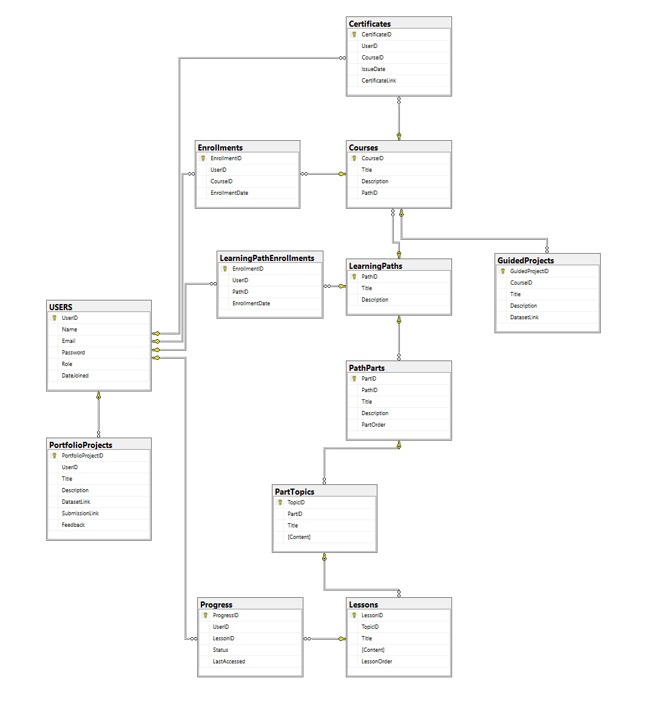

# Plataforma Educativa - Base de Datos

Este proyecto implementa una base de datos para gestionar y analizar información educativa en una plataforma de aprendizaje. El proyecto incluye tanto una base de datos OLTP (Online Transaction Processing) para gestionar transacciones y operaciones en tiempo real, como una base de datos de Business Intelligence (BI) para análisis avanzado de los datos. 

## Características

- Gestión de usuarios: estudiantes, profesores y administradores.
- Control de inscripciones y seguimiento de progreso.
- Análisis y reporte de desempeño académico.
- Relación entre cursos y materiales educativos.
- Base de datos OLTP para gestión de operaciones en tiempo real.
- Base de datos de Business Intelligence para análisis y visualización de datos.
- **Próximamente**: CLI en Python para interactuar con las bases de datos de manera más eficiente.

## Tecnologías Utilizadas

- SQL para la gestión y manipulación de la base de datos.
- Scripts SQL para la creación de tablas, consultas y procedimientos almacenados.
- **Próximamente**: Python para la creación de una interfaz de línea de comandos (CLI) que facilite la interacción con los datos.

## Estructura de la Base de Datos

La base de datos incluye las siguientes tablas principales:

- `usuarios`: almacena la información de los estudiantes y profesores.
- `cursos`: contiene los detalles de cada curso disponible.
- `inscripciones`: relaciona a los estudiantes con los cursos inscritos.
- `evaluaciones`: registra las evaluaciones y notas de los estudiantes.

 

## Instalación

1. Clona el repositorio:
   ```bash
   git clone https://github.com/kirito9623/bd_education_platform.git
